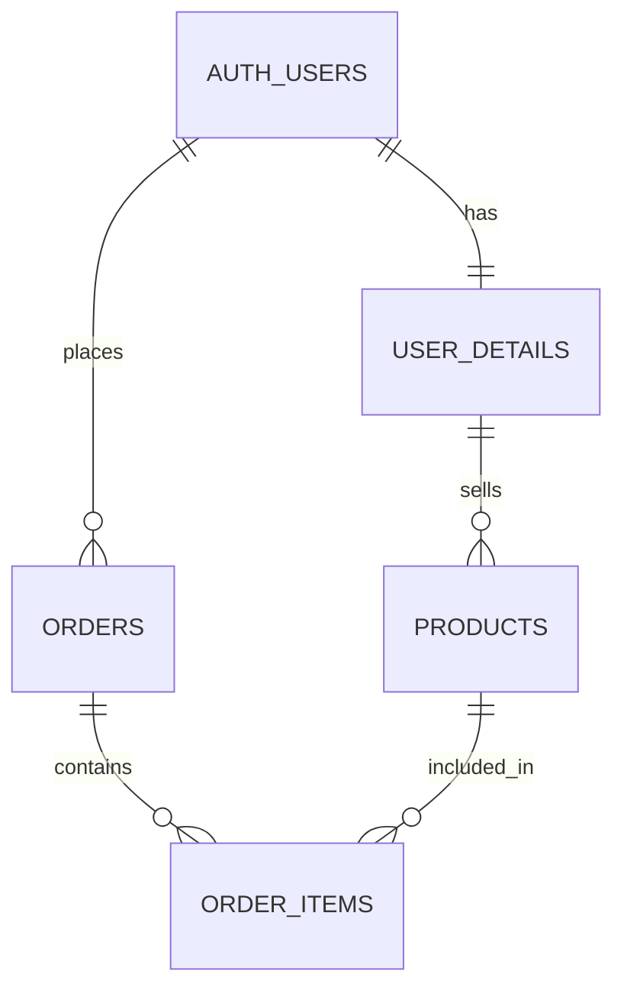

# AX_TeamDB

> 회원부터 상품, 주문까지. DB 스키마 관계도를 바탕으로 Supabase 데이터베이스와 Python CRUD를 함께 실습하는 팀 프로젝트입니다.


## 프로젝트 소개

판매자가 상품을 등록하고 구매자가 주문하는 흐름을 중심으로 관계형 데이터베이스를 설계합니다. 테이블별 브랜치에서 작업하고, Jupyter Notebook으로 동작을 확인하며 결과를 통합합니다.

- **관계 설계**: 기본 키, 외래 키, 1:1 및 1:N 관계 이해
- **데이터 처리**: Supabase Python SDK를 활용한 CRUD 실습
- **팀 협업**: 테이블별 브랜치 분리와 공통 환경 공유

`ex.ipynb`에서 로그인, 내 정보 조회, 상품 주문, 배송 상태 변경과 로그아웃을 순서대로 시연합니다. `AuthUsers`는 인증과 본인 정보 조회를, `UserService`는 회원 상세정보 관리를 담당합니다. 기존 클래스의 모든 CRUD 메서드가 완성되었다는 뜻은 아니며, 발표는 아래 실습 범위를 기준으로 진행합니다.

## 데이터베이스 구조

아래는 실습에 사용할 주요 관계입니다. 실제 DB 적용 상태를 나타내는 도표는 아닙니다.



| 테이블 | 역할 | 작업 브랜치 |
| --- | --- | --- |
| `auth.users` | 회원 인증 정보 | `feature/auth-users` |
| `user_details` | 회원 유형, 연락처, 주소 등 상세 정보 | `feature/user-details` |
| `products` | 판매 상품과 가격 정보 | `feature/products` |
| `orders` | 주문자, 배송지, 주문 금액과 상태 | `feature/orders` |
| `order_items` | 주문에 포함된 상품과 구매 수량 | `feature/order-items` |
| `orders.order_status` | 주문 테이블의 상태 문자열 | 별도 상태 테이블을 사용하지 않는 발표 예제 |

## 프로젝트 구성

```text
AX_TeamDB/
├── ex.ipynb          # 발표용 Python 코드 셀 16개와 설명
├── users.ipynb       # AuthUsers, UserService
├── products.ipynb    # 상품 등록, 조회, 수정, 삭제
├── orders.ipynb      # 주문 서비스
├── order_items.ipynb # 주문상품 서비스
├── sql/             # SQL Editor에 복사할 쿼리 11개와 설명
├── docs/            # 발표 PPT
├── pyproject.toml    # Python 버전과 의존성 정의
├── uv.lock           # 의존성 버전 고정
├── .python-version  # Python 3.13 지정
├── .gitignore       # 가상환경, 환경 변수 파일 등 제외
└── README.md
```

주문 상태는 `orders.order_status`에 저장합니다. `.venv`는 환경 설치 시 각자 로컬에서 생성합니다.

## 시작하기

Python 3.13 환경, `uv`, VS Code의 Python/Jupyter 확장을 준비합니다.

### 1. 저장소 클론

```powershell
git clone https://github.com/Cocode96/AX_TeamDB.git
cd AX_TeamDB
```

이미 클론했다면 해당 저장소 폴더에서 다음 단계부터 진행합니다.

### 2. 가상환경과 패키지 설치

```powershell
uv sync --locked
```

`uv.lock`에 기록된 버전으로 `.venv`를 구성합니다. 주요 패키지는 `supabase`, `python-dotenv`, `ipykernel`입니다.

### 3. 노트북 열기

1. VS Code에서 `AX_TeamDB` 폴더를 엽니다.
2. 발표용 `ex.ipynb`를 엽니다.
3. 오른쪽 위 **커널 선택**에서 프로젝트의 `.venv` Python 환경을 선택합니다.
4. Python 코드 셀 16개를 위에서부터 하나씩 실행합니다. SQL 블록은 Supabase SQL Editor에 복사해 실행합니다.

실습에는 Supabase 연결과 준비된 테이블이 필요합니다. 로컬 `.env`에 `SUPABASE_URL`과 `SUPABASE_PUBLISHABLE_KEY`를 설정합니다. URL은 프로젝트 기본 주소이며 `/rest/v1`을 붙이지 않습니다. `.env`와 비밀번호는 커밋하지 않습니다. 기존 실습 계정으로 로그인하며, 상품을 생성하려면 활성 회원 상세정보의 유형이 `SELLER`여야 합니다. 주문 셀을 실행하면 실제 DB에 주문과 주문상품이 추가됩니다.

## 발표 자료

- [발표 노트북](ex.ipynb): 실행 코드와 셀별 설명
- [SQL 제목, 설명과 실행 순서](sql/README.md): 집계, JOIN, 집합, 서브쿼리, 트랜잭션
- [발표 PPT](docs/DB_주문_시연_발표_최신.pptx): 13장, 발표자 노트 포함
- [Notion 발표 설명](https://app.notion.com/p/3d8dc8b0e1638100ab71d26bd7b39870): 발표할 말과 초보용 상세 설명 분리

마지막 셀은 로그아웃입니다. SDK의 `self` 반환은 메서드 체이닝 예제이며 LangChain 라이브러리를 실행하는 예제와 구분합니다.

## 브랜치 작업 흐름

`main`은 공통 기준 브랜치입니다. 작업을 시작할 때 최신 `main`을 담당 브랜치에 반영합니다. 아래는 상품 담당 예시입니다.

```powershell
git switch main
git pull --ff-only origin main
git switch feature/products
git merge main
```

작업을 검증한 뒤 변경한 파일만 커밋하고 담당 브랜치에 push합니다. 다른 테이블은 위 표의 브랜치 이름을 사용합니다.
