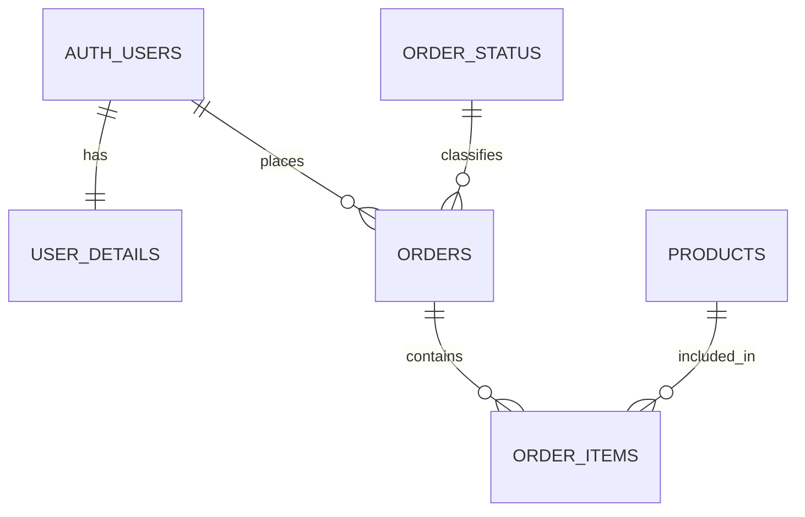

# AX_TeamDB

> 회원부터 상품, 주문까지. DB 스키마 관계도를 바탕으로 Supabase 데이터베이스와 Python CRUD를 함께 실습하는 팀 프로젝트입니다.


## 프로젝트 소개

판매자가 상품을 등록하고 구매자가 주문하는 흐름을 중심으로 관계형 데이터베이스를 설계합니다. 테이블별 브랜치에서 작업하고, Jupyter Notebook으로 동작을 확인하며 결과를 통합합니다.

- **관계 설계**: 기본 키, 외래 키, 1:1 및 1:N 관계 이해
- **데이터 처리**: Supabase Python SDK를 활용한 CRUD 실습
- **팀 협업**: 테이블별 브랜치 분리와 공통 환경 공유

현재는 **개발 환경과 서비스 클래스의 기초 노트북을 준비한 단계**입니다. 노트북의 클래스 본문은 `pass`이며, DB 생성 스크립트와 실제 CRUD 구현은 아직 포함되어 있지 않습니다.

## 데이터베이스 구조

아래는 실습에 사용할 주요 관계입니다. 실제 DB 적용 상태를 나타내는 도표는 아닙니다.



| 테이블 | 역할 | 작업 브랜치 |
| --- | --- | --- |
| `auth.users` | 회원 인증 정보 | `feature/auth-users` |
| `user_details` | 회원 유형, 연락처, 주소 등 상세 정보 | `feature/user-details` |
| `products` | 판매 상품과 가격 정보 | `feature/products` |
| `orders` | 주문자, 배송지, 주문 금액과 상태 | `feature/orders` |
| `order_items` | 주문에 포함된 상품과 구매 수량 | `feature/order-items` |
| `order_status` | 주문 상태 코드 | `feature/order-status` |

## 프로젝트 구성

```text
AX_TeamDB/
├── users.ipynb       # auth.users, user_details 서비스 기초
├── products.ipynb    # products 서비스 기초
├── orders.ipynb      # orders, order_items 서비스 기초
├── pyproject.toml    # Python 버전과 의존성 정의
├── uv.lock           # 의존성 버전 고정
├── .python-version  # Python 3.13 지정
├── .gitignore       # 가상환경, 환경 변수 파일 등 제외
└── README.md
```

`order_status`는 작업 브랜치만 준비되어 있으며, 별도 노트북은 아직 없습니다. `.venv`는 환경 설치 시 각자 로컬에서 생성합니다.

## 시작하기

Python 3.13 환경, `uv`, VS Code의 Python/Jupyter 확장을 준비합니다.

### 1. 저장소 클론

```powershell
git clone https://github.com/Cocode96/AX_TeamDB.git
cd AX_TeamDB
```

이미 클론했다면 해당 저장소 폴더에서 다음 단계부터 진행합니다.

### 2. 가상환경과 패키지 설치

```powershell
uv sync --locked
```

`uv.lock`에 기록된 버전으로 `.venv`를 구성합니다. 주요 패키지는 `supabase`, `python-dotenv`, `ipykernel`입니다.

### 3. 노트북 열기

1. VS Code에서 `AX_TeamDB` 폴더를 엽니다.
2. 담당 영역의 `.ipynb` 파일을 엽니다.
3. 오른쪽 위 **커널 선택**에서 프로젝트의 `.venv` Python 환경을 선택합니다.
4. 코드 셀을 실행하고 담당 서비스의 기능을 구현합니다.

현재 기초 셀은 DB 연결 없이 실행할 수 있습니다. Supabase 연결에 사용할 `.env`는 저장소에 포함되어 있지 않으며, 연결 코드를 구현할 때 로컬에서 설정합니다.

## 브랜치 작업 흐름

`main`은 공통 기준 브랜치입니다. 작업을 시작할 때 최신 `main`을 담당 브랜치에 반영합니다. 아래는 상품 담당 예시입니다.

```powershell
git switch main
git pull --ff-only origin main
git switch feature/products
git merge main
```

작업을 검증한 뒤 변경한 파일만 커밋하고 담당 브랜치에 push합니다. 다른 테이블은 위 표의 브랜치 이름을 사용합니다.

## 다음 구현

- [ ] 테이블 생성과 외래 키 관계 설정
- [ ] Supabase 연결 코드 작성
- [ ] 회원, 상품, 주문 서비스의 CRUD 구현
- [ ] 주문 상태 코드 구성과 주문 흐름 확인
- [ ] 입력 검증, 오류 처리와 삭제 정책 검증
